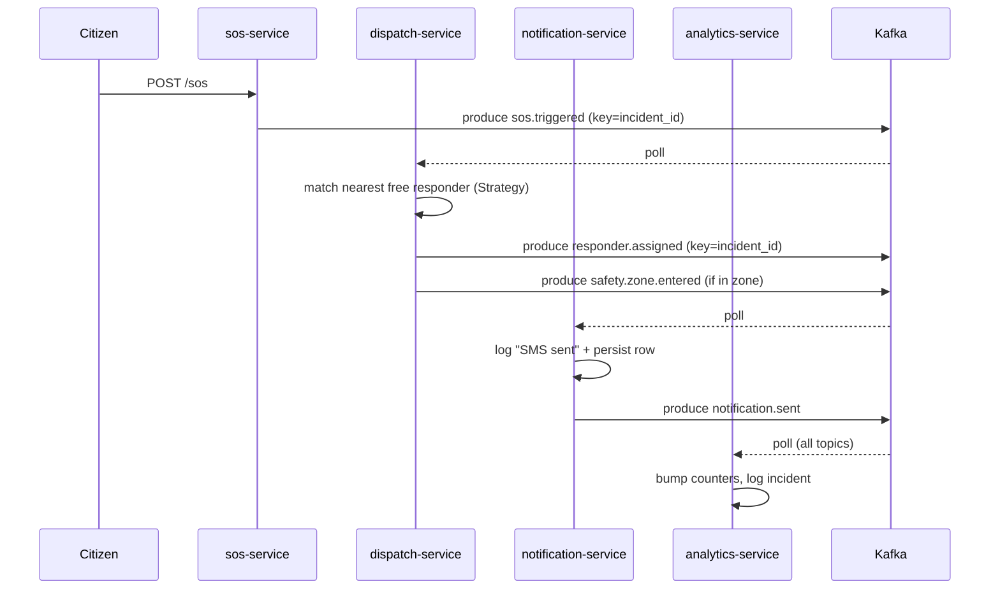
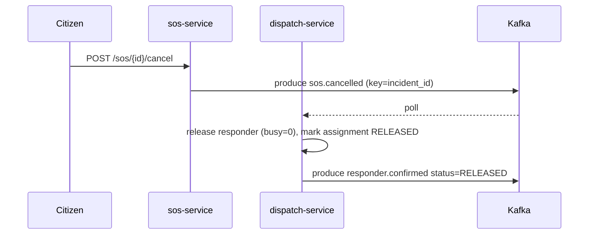

# HELEP — Architecture Overview (Lecturer Reference)

This is the reference architecture the **lecturer** uses to grade. Students  must derive equivalent content for their L4 design-process document.

## 1. SRS → Service mapping

The SRS lists 8 components. We collapse them into **5 minimal-viable services** for a 24-hour build budget.

| SRS Component | Service | Notes |
|---------------|---------|-------|
| User Management | `user-service` | identity, JWT, credibility, emergency contacts |
| Emergency Component | `sos-service` | SOS trigger, simulated mic/cam capture, cancel |
| Incident Report & Response | `sos-service` + `dispatch-service` (split) | trigger lives in SOS; assignment + confirm in dispatch |
| Localization | `dispatch-service` | haversine distance match |
| Alert Management | `dispatch-service` (zone detection) + `notification-service` (delivery) | split: who decides vs who delivers |
| Alert (delivery) | `notification-service` | SMS/push simulated |
| Feedback & Review | *out of scope* | bonus extension |
| Analytics & Statistics | `analytics-service` | police view, zone heatmap |

## 2. Service inventory (5)

| Port | Service | Lang | Stack |
|------|---------|------|-------|
| 8001 | user-service | Python 3.12 | FastAPI + bcrypt + PyJWT |
| 8002 | sos-service | Python 3.12 | FastAPI + PyJWT |
| 8003 | dispatch-service | Python 3.12 | FastAPI + custom matching strategies |
| 8004 | notification-service | Python 3.12 | FastAPI |
| 8005 | analytics-service | Python 3.12 | FastAPI |

Shared infra:
- **Apache Kafka** — event broker. Single broker in KRaft mode for dev compose; **Strimzi-managed cluster** in the student's K8s submission (Part D). Topic partitions keyed by `incident_id` so all events for one SOS land on a single partition → ordering preserved → "no double dispatch" invariant survives even with multi-replica consumers.
- **SQLite per service** — easy local dev; students must convert to `PersistentVolumeClaim` in K8s. Holds idempotency state (assignment row PK, unique constraints).

## 3. Event topology (Kafka topics, partitioned by `incident_id`)

```
user.registered        → analytics
sos.triggered          → dispatch · notification(offline only) · analytics
sos.cancelled          → dispatch · analytics
responder.assigned     → notification · analytics
responder.confirmed    → notification · analytics
safety.zone.entered    → notification · analytics
notification.sent      → analytics
```

Consumer groups: one per service (e.g. `dispatch-service`, `notification-service`, `analytics-service`). Multiple replicas of a service share the group → events partitioned across pods.

## 4. Saga (choreography) — happy path



## 5. Compensation (saga rollback)

When the victim cancels:



## 6. Architectural drivers (ASRs from SRS §3)

| Driver | Where addressed |
|--------|-----------------|
| Availability | event-driven async, consumer groups, K8s HPA, multi-replica deployments |
| Reliability  | at-least-once delivery via manual `consumer.commit()` after handler success, idempotent handlers, dispatch assignment PK |
| Scalability  | stateless services + Strimzi-managed Kafka StatefulSet; topic partitions enable parallel consumers within a group |
| Confidentiality | JWT auth, K8s Secrets for `JWT_SECRET`, NetworkPolicy default-deny |
| Integrity    | bcrypt password hashing, single-writer assignment row, atomic claim |
| Usability    | thin REST surface, predictable JSON responses |
| Portability  | container per service, Helm chart values for env-specific config |

## 7. Constraint satisfaction (SRS §4)

| Constraint | Mechanism |
|------------|-----------|
| Single response at any moment | `responders.busy` flag, atomic `UPDATE … WHERE busy=0` (dispatch/db.py) |
| Trigger → notify < 1 second | Kafka in-memory log + small JSON payload + no external HTTP between hops; `acks="all"` idempotent producer keeps latency sub-second on a local broker |


## 8. Patterns inventory (for L3 doc — students must cite)

| Pattern | File reference |
|---------|----------------|
| Choreographed Saga | spans `sos-service/app/main.py`, `dispatch-service/app/main.py`, `notification-service/app/main.py` |
| Pub/Sub (Kafka topics + consumer groups) | each service's `app/events.py` |
| Repository | each service's `app/db.py` |
| Strategy | `dispatch-service/app/matching.py` |
| Outbox-lite | `sos-service/app/main.py` `trigger()` — db insert then `await publish(...)` in same async block |
| Circuit breaker (stub) | each `events.py` `class CircuitBreaker` — student completes state machine |

Students must identify these AND add **2 additional patterns** of their own — e.g. CQRS (separate analytics read model), Bulkhead (separate Kafka consumer group per service), Idempotency key (SQLite unique constraint or Kafka transactional producer), API Gateway (Ingress + path rewrite), Sidecar (Envoy/Istio proxy).

## 9. Out of scope (stays simulated)

- Real SMS provider — `notification-service` logs and writes a DB row.
- Real audio/video upload — `sos-service` stamps a fake `sim://` URI.
- Real GPS — caller passes lat/lon in JSON.
- Real police view UI — `/stats/*` endpoints are JSON only.
