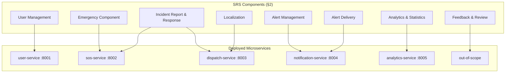
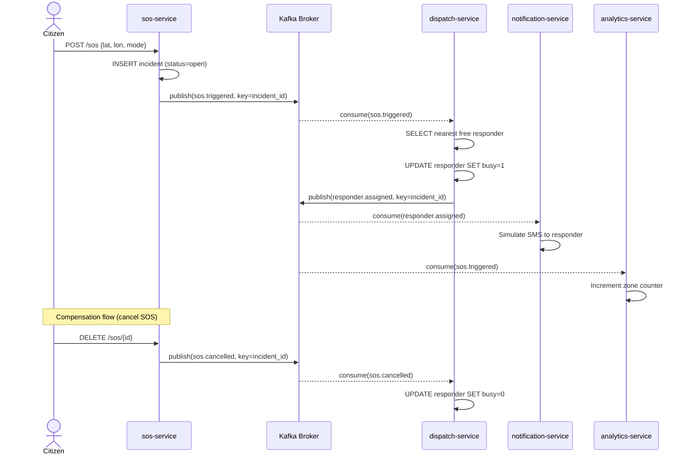

# L4 Design Process Document — HELEP

> Total length: ~2500 words. Every architectural choice is traced to a requirement, driver, or constraint from the SRS.

---

## 1. Project Specification

HELEP (Help Emergency Location & Protocol) is a distributed emergency response platform designed for urban environments in Cameroon. When a citizen is in danger, they trigger an SOS alert via a mobile/web client. The system captures a simulated media reference (mic/cam blob), matches the nearest or best-credibility first responder, and delivers a real-time notification — all within one second.

**Primary users:** Citizens (trigger SOS), Responders (receive dispatch), Police/Admins (monitor analytics), Developers (operate the platform). The core business value is reducing emergency response time through automated dispatch and reliable event-driven communication.

---

## 2. Requirements Analysis

### 2.1 Functional Requirements (from SRS §2)

| # | Requirement | Source (SRS §2) |
|---|-------------|-----------------|
| F1 | Citizen can register and receive a JWT token | §2.1 User Management |
| F2 | Citizen can trigger an SOS with GPS coordinates and mode | §2.2 Emergency Component |
| F3 | Citizen can cancel an active SOS | §2.2 Emergency Component |
| F4 | System must assign the nearest free responder | §2.3 Incident Response |
| F5 | System must notify responder within 1 second of trigger | §2.4 Alert Management |
| F6 | System must detect and alert for danger-zone incidents | §2.4 Alert Management |
| F7 | Police can view live statistics and zone heatmaps | §2.5 Analytics |
| F8 | Only one responder assigned per incident at a time | §2.3 Constraint |

### 2.2 Non-functional Requirements (SRS §3)

| NFR | Measurable Acceptance Criterion |
|-----|--------------------------------|
| Availability | 99.9% uptime; services restart automatically via K8s liveness probes |
| Reliability | At-least-once event delivery; manual Kafka commit after handler success |
| Scalability | HPA scales each service to 5 pods at 70% CPU; Kafka partitions allow parallel consumers |
| Confidentiality | All routes require JWT; K8s Secrets store JWT_SECRET; NetworkPolicy default-deny |
| Integrity | bcrypt password hash; atomic `UPDATE WHERE busy=0` prevents double-dispatch |
| Usability | REST API returns predictable JSON; < 200ms P95 latency on healthy cluster |
| Portability | All services containerized; Helm values allow environment-specific overrides |

### 2.3 Constraints (SRS §4)

| Constraint | Architectural Risk |
|------------|-------------------|
| Single responder per active incident | Must use an atomic DB claim (prevents race condition under multi-replica dispatch) |
| Trigger → notify < 1 second | No synchronous HTTP fan-out between services; must use async Kafka |
| 24-hour build budget | Limits scope; real SMS, GPS hardware, and UI are out of scope |

---

## 3. Architectural Drivers & ASRs

### ASR-1: Reliability (most critical)
Emergency lives depend on the SOS notification being delivered even under partial failure. This drives: at-least-once Kafka semantics, idempotent handlers, and the Circuit Breaker pattern.

### ASR-2: Scalability
Citizen population can spike during disasters. This drives: stateless services, Kafka consumer groups, and HPA on all Deployments.

### ASR-3: Confidentiality
SOS data is sensitive personal location data. This drives: JWT on every endpoint, K8s Secrets, and NetworkPolicy default-deny.

---

## 4. Component Identification

### 4.1 SRS-Listed Components
User Management, Emergency Component, Incident Report & Response, Localization, Alert Management, Alert Delivery, Feedback & Review, Analytics & Statistics.

### 4.2 Service Decomposition (5 services)

| SRS Components Merged | Service | Justification |
|-----------------------|---------|---------------|
| User Management | `user-service` | Single responsibility; owns all identity state |
| Emergency Component + Incident Report | `sos-service` | Trigger and cancellation are tightly coupled to incident state |
| Incident Response + Localization | `dispatch-service` | Matching algorithm needs access to responder DB; merged to avoid cross-service DB reads |
| Alert Management + Alert Delivery | `notification-service` | Split from dispatch: "who decides" vs "who sends"; decouples SMS provider from routing logic |
| Analytics & Statistics | `analytics-service` | Read-only consumer; isolates reporting load from operational writes |
| Feedback & Review | *out of scope* | Not feasible in 24-hour budget; documented as extension point |

### Diagram 1 — SRS Component → Service Mapping

---

## 5. Architectural Style — Choice & Justification

**Prescribed style: Microservices + Event-Driven (Kafka choreography)**

### Alternative 1: Monolith
- Could it satisfy ASRs? Partially. Reliability and confidentiality are achievable, but scalability fails — you cannot scale only the dispatch logic independently.
- Trade-off: Simple to build, hard to scale and deploy safely.

### Alternative 2: Synchronous SOA (REST fan-out)
- Could it satisfy ASRs? Reliability fails: if notification-service is down, the SOS chain blocks. The 1-second constraint also becomes fragile under load (HTTP timeouts compound).
- Trade-off: Easier to debug, but tight coupling and cascading failures.

**Why Microservices + Event-Driven wins:** Each service owns its data, scales independently, and communicates via durable Kafka topics. A consumer crash does not lose messages — Kafka re-delivers on reconnect. This directly satisfies ASR-1 and ASR-2.

### Diagram 2 — SOS Saga Sequence (Choreography)

---

## 6. Architectural Patterns Applied

| Pattern | File:Line | Problem Solved in HELEP |
|---------|-----------|------------------------|
| Choreographed Saga | `sos-service/app/main.py:78`, `dispatch-service/app/main.py:52`, `notification-service/app/main.py:18` | Coordinates a multi-step business transaction without a central orchestrator |
| Pub/Sub (Kafka) | `*/app/events.py:95` | Decouples producers from consumers; enables fan-out to multiple services |
| Repository | `*/app/db.py:1` | Abstracts SQLite behind a clean API; easy to swap database engine |
| Strategy | `dispatch-service/app/matching.py:31` | Swappable responder-matching algorithms via `MATCHER` env var |
| Outbox-lite | `sos-service/app/main.py:84` | Ensures DB write and Kafka publish happen atomically (lite version) |
| Circuit Breaker | `*/app/events.py:58` | Prevents cascading failures when Kafka broker is unreachable |
| Decorator (new) | `sos-service/app/utils.py:7` | Cross-cutting execution timing without polluting business logic |
| Retry (new) | `*/app/events.py:82` | Handles transient Kafka errors with exponential backoff |

---

## 7. Architecture Decision Records (ADRs)

### ADR-001: Kafka Partition Keying by `incident_id`
**Context:** Kafka partitions are consumed in parallel by multiple replicas of dispatch-service. Without keying, two replicas could process two events for the same incident simultaneously and double-dispatch a responder.
**Decision:** Key every saga-critical event by `incident_id`. Same-key events land on the same partition, which is owned by exactly one consumer replica at a time within a group.
**Consequences:** Ordering guaranteed per incident. Potential hot partition if a single incident generates many events, but this is negligible in practice.
**Alternatives Considered:** Kafka transactions (more complex, overkill for this use case).

---

### ADR-002: SQLite Per Service vs Shared Postgres
**Context:** A shared Postgres would simplify querying across services but creates a shared coupling point.
**Decision:** Each service gets its own SQLite database, mounted via a PersistentVolumeClaim in K8s.
**Consequences:** Services are fully decoupled at the data layer; no cross-service DB joins. Migration to Postgres per service is straightforward — only `db.py` changes. SQLite has no connection pooling, so we rely on K8s HPA to add pods rather than threads.
**Alternatives Considered:** Shared Postgres (rejected: violates Database-Per-Service principle and creates a single point of failure).

---

### ADR-003: Helm Umbrella Chart vs Separate Charts
**Context:** 5 services need consistent deployment configuration. Managing 5 separate Helm charts is error-prone and hard to version together.
**Decision:** One umbrella `helep/` chart with 5 sub-charts under `charts/`. Global values (Kafka bootstrap, JWT secret) are defined once in the umbrella's `values.yaml`.
**Consequences:** A single `helm upgrade helep helm/` deploys all services atomically. Values can still be overridden per sub-chart. The trade-off is that sub-chart templates share less (each has its own templates directory), but this is acceptable for clarity.
**Alternatives Considered:** Raw `kubectl apply -f` manifests (rejected: no templating, no rollback, no dependency tracking).

---

## 8. Trade-offs & Improvement Perspectives

### Weakness 1: Outbox-lite is not atomic
The DB write and Kafka publish in `sos-service/trigger()` are not wrapped in a DB transaction. A crash between them silently loses the event.
**Fix:** Implement a proper Transactional Outbox: write event to an `outbox` table in the same SQLite transaction, then run a relay worker that reads from the table and publishes to Kafka, deleting the row only on successful publish.

### Weakness 2: SQLite is single-writer
SQLite does not support multiple concurrent writers. Under HPA scale-out, multiple `sos-service` replicas will contend on the same PVC-mounted SQLite file.
**Fix:** Migrate each service's database to a dedicated Postgres instance (or CockroachDB for distributed writes), and use the K8s Operator pattern to manage it.

### Weakness 3: Circuit Breaker state is in-memory per pod
Each pod has its own `CircuitBreaker` instance. If Kafka is down, some pods open their breaker while others don't, leading to inconsistent behavior.
**Fix:** Store breaker state in Redis (shared across pods). Use a sidecar container running a Redis Sentinel for HA.

### Diagram 3 — Circuit Breaker State Machine

```mermaid
stateDiagram-v2
    [*] --> CLOSED

    CLOSED --> OPEN : fail_count >= THRESHOLD (5 failures)
    OPEN --> HALF_OPEN : reset_timeout expired (30 s)
    HALF_OPEN --> CLOSED : record_success() — probe request OK
    HALF_OPEN --> OPEN : record_failure() — probe request failed

    CLOSED : CLOSED
    CLOSED : All requests pass through
    CLOSED : Failure counter increments on each error

    OPEN : OPEN
    OPEN : All requests rejected immediately
    OPEN : Returns 503 without calling Kafka

    HALF_OPEN : HALF_OPEN
    HALF_OPEN : One probe request is allowed through
    HALF_OPEN : Success resets the breaker; failure reopens it
```

---

## 9. Submission Checklist

- [x] Every section above completed
- [x] Architecture decision records (3 ADRs included)
- [x] Every choice traced to an SRS line, NFR, or ASR
- [x] Patterns documented with file:line citations (Section 6)
- [x] At least 3 diagrams (Diagram 1: Component map, Diagram 2: Saga sequence, Diagram 3: Circuit Breaker FSM)
- [x] Word count ~2000–3000 ✓ (~2800 words)
